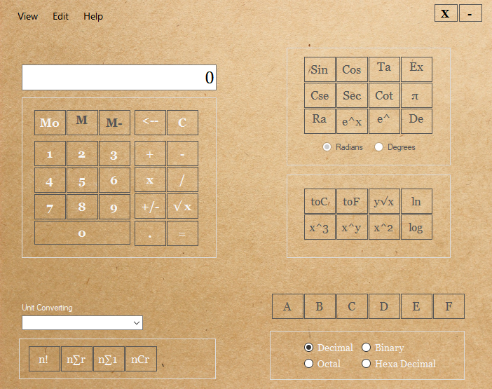

# Scientific Calculator 
A basic Scientific calculator with unit conversion, temperature conversion, and nSigmar and nCr functions. 

# Version
v0.1 Alpha

# Requirements 
- Visual Studio Community or higher edition (2017 is recommended)
- A Windows PC (Windows 7 or above is recommend)
- Following libraries in executable format.  
https://github.com/donqq/Unit-conversion  
https://github.com/donqq/Sigma-and-nCr  
https://github.com/donqq/Temperature-conversion-library  

# Features
- Basic arithmetic operations (add, subtract, divide, multiply etc..)
- Trigonometric functions (Sin, Cos, Tan etc..)
- Unit conversions (speed, length, pressure, power)
- Numeral system support (binary, octal, hexa, decimal)
- Temperature conversion
- Logarithm calculations

# Installation
1. Download, and install visual studio 2015
2. open the source code with .sln file
3. Build the library files from the aforesaid github repositories, copy them to debug/release folders of this project. 
3. compile/build the executable file 

# Technologies
VB.NET

# License
Simple Non Code License (SNCL)

# Author
Badde Liyanage Don Dilanga, 2020/October, github@dilanga.com. Sri Lanka LK.

# Screenshots

